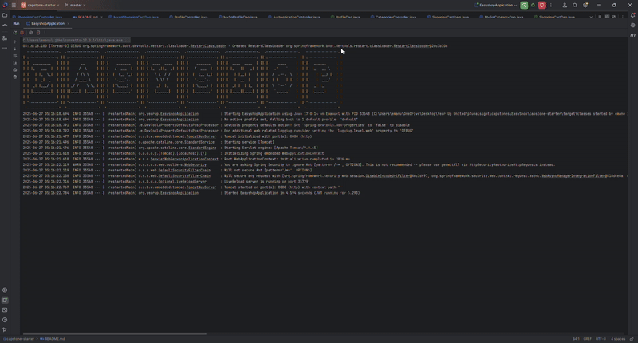

# Project Title
EASY SHOP

## Description of the Project
A Spring Boot application providing a secure, JSON-driven back-end for managing product catalogs and user carts. It exposes CRUD endpoints for Categories and Products (with role-based access for ADMINs), plus a ShoppingCart service for authenticated users.  Key features include:
- Role-based security (USER vs. ADMIN) via Spring Security
- Category & Product management (GET/POST/PUT/DELETE)
- Flexible product search filters (category, price range, color)
- Shopping cart operations (add, clear) tied to logged-in users
- MySQL persistence with JDBC / DAO pattern
- Comprehensive unit and integration tests
  This project demonstrates clean REST design, proper exception handling, and dynamic query building in a real-world Spring Boot microservice.

## User Stories
As any authenticated or anonymous visitor I want to see a list of all categories so that I can decide what products to explore.
As any visitor I want to fetch details of one category by ID so that I can read its description.
As an administrator I want to add a new category So that I can organize products for customers
As an administrator I want to modify a category’s name or description So that category info stays up-to-date.
As an administrator I want to remove a category So that outdated or empty categories aren’t shown.
As a shopper I want to filter products by category, price range, and/or color So that I only see the items I care about.
As an administrator I want update operations to modify an existing product instead of creating new rows So that I never end up with multiple near-identical products in the catalog.
As a security auditor I want create/update/delete product endpoints to be accessible only by ADMINs So that regular users can’t modify the catalog.

## Setup

Create a new project, Project Title: Easy Shop
Check create GitHub repo
Ensure that Maven is builder
Ensure Java 17 is language
Click create and the add new package
Add classes needed for the Sandwich Factory.
Add receipts folder

### Prerequisites

- IntelliJ IDEA: Ensure you have IntelliJ IDEA installed, which you can download from [here](https://www.jetbrains.com/idea/download/).

- Java SDK: Make sure Java SDK is installed and configured in IntelliJ.

### Running the Application in IntelliJ

Follow these steps to get your application running within IntelliJ IDEA:

1. Open IntelliJ IDEA.

2. Select "Open" and navigate to the directory where you cloned or downloaded the project.

3. After the project opens, wait for IntelliJ to index the files and set up the project.

4. Find the main class with the `public static void main(String[] args)` method.

5. Right-click on the file and select 'Run 'YourMainClassName.main()'' to start the application.

## Technologies Used
Java: 17.
IntelliJ.
GitHub & GitHub projects
GitBash
Spring Boot
PostMan

## Demo

## Future Work

Implement check out cart feature.

## Resources
Raymond
Potato Sensei
Workbook 7
Workbook 8
Workbook 9

## Team Members

Emanuel Galloway Project Owner / Senior Developer

## Thanks

Thank you to Raymond for teaching me and taking the time to ensure I have a solid foundation in backend software development. It has been a pleasure and I will miss you.

 